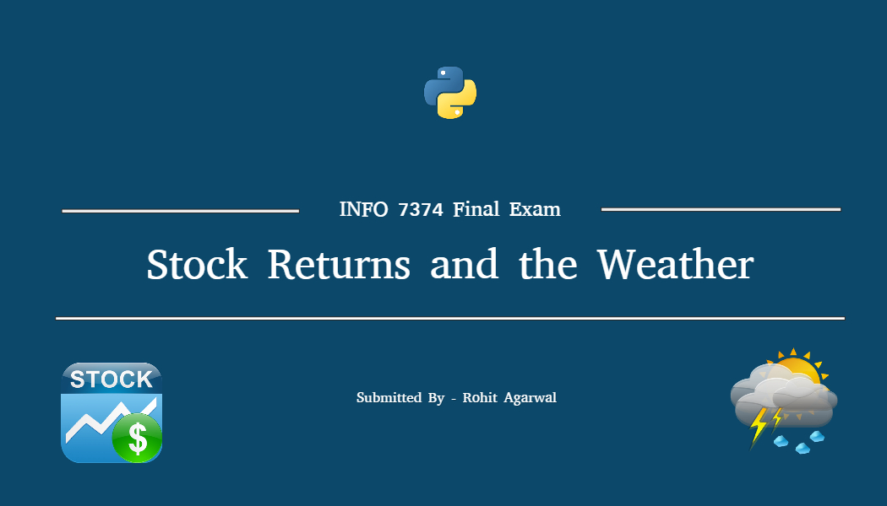

<i>Does Weather Affect the Stock Market? </i>

## Table of Contents
1. [Idea](#1-idea)
2. [Data Collection](#2-data-collection)
3. [Data Storing](#3-data-storing)
4. [Analysis 1](#4-analysis-1)
5. [Analysis 2](#5-analysis-2)
6. [Analysis 3](#6-analysis-3)
7. [References](#7-references)

## 1. Idea
#### Does Weather Affect the Stock Market?

Despite the best efforts of many highly trained economists and market specialists, there is no widespread consensus about how, or even if, weather affects the performance of the stock market.

It seems commonsensical that it must have some impact, since weather is a ubiquitous phenomenon from which traders are never fully isolated. On the other hand, there isn't a clear-cut, logical reason to expect that rain on Wall Street or a hurricane in Mexico should systematically change valuations or trader optimism. 

> __"Ultimately it's an interesting question."__

__As it's an Interesting Question. Let's find How Weather affect Renewable & Non Renewable Energy.__

## 2. Data Collection
I have collected Historical Data for year 2012-2017 using two different API's.

Packages Used -:
- OS
- Request
- JSON
- Date

__API 1__.

1- Wunderground (Weather Forecast API)

  - Used Wunderground Historical Data API for New York.
  - New York in particular because Stock Exchange is located there.
  - Collected Data on daily basis from year 2012-2017 (April).
  - Data is collected in form of JSON.
  - Naming Convention is given on date basis. So, Every file is unique.
  - There are total of around 1800 Json Files.
  - I have created one function that made an API call inside loop and download all Data in json.
  
  ##### NOTE- 
  - Data is collected on daily basis because of per day limit.
  - Daily limit was 500. So, All Data is collected in 4 days.
  - API key is save in Environment Variable.
  - Data is only collected for New York City.
  
 **Data Source:** https://github.com/JostineHo/mememoji_api
 
 
 __API 2__.

2- Quandl (Stock Exchange API)

  - Used Quandl Historical Data API for Stocks of major compnaies (OIL & Solar).
  - OIL & SOLAR in particular because idea is impact on renewable & non renewable energies.
  - Collected Data from year 2012-2017 (April).
  - Data is collected in form of JSON.
  - Naming Convention is given on compnay code basis. So, Every file is unique.
  - I have created one function that made an API call inside loop and download all Data in json.
  
  ##### NOTE- 
  - API key is save in Environment Variable.
  - Data is only collected for OIL & SOLAR.
  
 **Data Source:** https://github.com/JostineHo/mememoji_api
 
 
 __Data for Wind Energy Company__.
 
 3- As I haven't found data for WIND ENERGY Company.
  - So I have downloaded CSV file from Yahoo Finance Website for Wind Energy for year 2012-2017 (April).
  - Direct Hit the url using request library and saved the CSV file.
  
  **Data Source:** https://github.com/JostineHo/mememoji_api
 
  **Source Code:** https://github.com/JostineHo/mememoji_api

## 3. Data Storing
As Collected Data was in the form of JSON file So I filtered and Stored in CSV Format for Analysis.

Packages Used -:
- Re
- Shutil
- CSV

__Wundeground API__.
  - Looped through all JSON files.
  - Extracted useful information like (Max Temp, Min Temp etc.)
  - Stored all extracted information in one CSV file.
  
  **Data Source:** https://github.com/JostineHo/mememoji_api

__Quandl API__.
  - Looped through all JSON files.
  - Extracted useful information like (Low Price, HIgh Price ect.)
  - Stored all extracted information in differet CSV file for different companies.
  
  **Data Source:** https://github.com/JostineHo/mememoji_api
  
  __Wind Energy DATA__.
   - Created a link in order to request data from Yahoo Finance.
   - Directly saved in CSV format.
   
   **Data Source:** [VWS.csv](https://github.com/rohitag04/agarwal_rohit_python_2017/edit/master/Final%20Exam/extra/VWS.csv)
   
   **Source Code:** https://github.com/JostineHo/mememoji_api
   
   ## 4. Analysis 1
### Topic - Impact of Weather on Energy Sources.

Packages Used -:
- OS
- Panda
- Plotly Offline
- iPlots
- Graph Objects

#### Step 1 (Temperature Trend)
  - Read Weather.CSV in order to create Scatter plot to see trend of Maximum Temp (C) on daily basis for year [2012, 2014, 2016]
  - As CSV file contain Date column so I parsed it while reading.
  - Split the Date column in Day & Month.
  - Used Plotly Graph Object Scatter function in order to create plot.
  
  
  
  ### After Analyzing the above graph we can say:
  - Every second year tempeature was increasing.
  - As we can see Red Color for 2016 is more compare to previous years.
  - 4(2012)
  - 7(2014)
  - 19(2016)

#### Note- 
  - As it's hard to spot rise in temparature on day basis.
#### So in order to make it visible I have plotted mean Tempearture for Every Year.

#### Step 2 (Annual Mean Temperature Trend)
  - Used the same Data Frame in order to find the mean.
  - Group by on Date coumn on basis of year.
  - Calculated the Mean of Max Temp. for each Year.
  - Used Plotly Graph Object Bar Plot function in order to create plot.
  
  
  
  ### After Analyzing the above graph we can say:
  - There is a rise in Annual Mean each year.
  - Which clearly proves that Temp. is increasing each year.
  - Which means Global Warming is increasing each year.
  
  #### Note-
  - The year 2016 ranks as the warmest on record. (Source: NASA/GISS).
  - GLOBAL WARMING is increasing.

#### Step 3 (Impact on OIL (Non Renewable))
#### Does Global Warming affect Oil Production?

  - Used the weather Data Frame.
  - Read Oil Company Stock name CVX.
  - Merged two dataframes outerly on Date Columns.
  - Removed all NAN values in order to keep clean file.
  - Analysed only for year 2012 & 2016.
  - Used Double Y axis plot in order to show Weather & Stock.
  
  
  
  ### After Analyzing the above graph we can say:
  - There is a rise in Annual Mean each year.
  - Which clearly proves that Temp. is increasing each year.
  - Which means Global Warming is increasing each year.
  
  #### Note-
  - The year 2016 ranks as the warmest on record. (Source: NASA/GISS).

